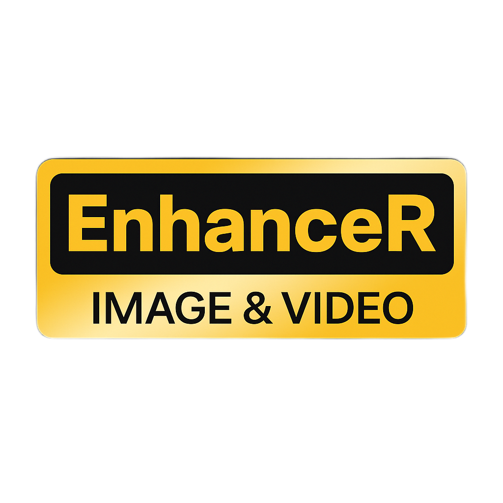

<p align="center">
  
</p>

## <div align="center"><b><a href="README.md">English</a> | <a href="README_RU.md">Русский</a></b></div>

[](https://github.com/xinntao/BasicSR/blob/master/LICENSE.txt)
[](https://www.python.org/downloads/release/python-380/)
[](https://www.python.org/downloads/release/python-390/)
[](https://www.python.org/downloads/release/python-3100/)
👀[**App demonstration**](#-app-demonstration) **|** 🔧[**Installation**](#-dependencies-and-installation) **|** 🚩[**Updates**](#-updates) **|** 

---

## English

### 📖 Real-ESRGAN: Training Real-World Blind Super-Resolution with Pure Synthetic Data

> [[Paper](https://arxiv.org/abs/2107.10833)] &emsp; [[YouTube Video](https://www.youtube.com/watch?v=fxHWoDSSvSc)] &emsp; [[B站讲解](https://www.bilibili.com/video/BV1H34y1m7sS/)] &emsp; [[Poster](https://xinntao.github.io/projects/RealESRGAN_src/RealESRGAN_poster.pdf)] &emsp; [[PPT slides](https://docs.google.com/presentation/d/1QtW6Iy8rm8rGLsJ0Ldti6kP-7Qyzy6XL/edit?usp=sharing&ouid=109799856763657548160&rtpof=true&sd=true)]<br>
> [Xintao Wang](https://xinntao.github.io/), Liangbin Xie, [Chao Dong](https://scholar.google.com.hk/citations?user=OSDCB0UAAAAJ), [Ying Shan](https://scholar.google.com/citations?user=4oXBp9UAAAAJ&hl=en) <br>
> [Tencent ARC Lab](https://arc.tencent.com/en/ai-demos/imgRestore); Shenzhen Institutes of Advanced Technology, Chinese Academy of Sciences
>
> was taken from [Real-ESRGAN](https://github.com/xinntao/Real-ESRGAN)

<p align="center">
  
</p>

### ✨ Features
- High-quality **image upscaling**
- **Frame interpolation** for smoother videos (e.g., 24 → 48/60 FPS)
- Batched processing for folders or single files
- GPU acceleration when available

---

## 🚩 Updates

- ✅ A couple of models was integrated: RealESRGAN_x2plus, RealESRGAN_x4plus, RealESRGAN_x4plus_anime_6B, realesr-animevideov3, GFPGANv1.3.
- ✅ The app contains dark, light and castle themes.
- ✅ **BETA:** Frame interpolation support.
- ✅ Added "About" section.
- ✅ Support for English and Russian languages.
- ✅ Image upscaling added.
- ✅ Video upscaling added.
- ✅ Variety of image enhancement extensions: .png, .jpg/.jpeg, .webp, .heic, .heif, .bmp.
- ✅ Variety of video enhancement extensions: .mp4, .mov, .mkv, .avi, .webm, .gif.
- ✅ Integrated presets system for image upscaling tab.
- ✅ Integrated ffmpeg path, output folder, language and theme for "auto save" in presets.

---

## 🔧 Dependencies and Installation

- Python >=3.8, <=3.10
- PIP >= 22.0

---

## Installation

1. Clone repo
```bash
git clone https://github.com/Sadddtop/Image-Video-Enhancer.git
cd Image-Video-Enhancer
````

2. Install dependent packages

```bash
pip install -r requirements.txt
```

---

To start the program, run the following command: ```python main.py```

---

## 👀 App Demonstration

### About (Dark Theme)
<p>
  
</p>

### Frame Generation (Light Theme)
<p>
  
</p>

### Image Processing (Castle Theme)
<p>
  
</p>

### Video Processing (Dark Theme)
<p>
  
</p>

## 📖 Credits

▶️ [Real-ESRGAN](https://github.com/xinntao/Real-ESRGAN): Upscaling tool <br>
▶️ [GFPGAN](https://github.com/TencentARC/GFPGAN): Face restoration algorithm <br>
▶️ [BasicSR](https://github.com/xinntao/BasicSR):  Image and video restoration toolbox <br>
▶️ [RIFE](https://github.com/hzwer/ECCV2022-RIFE): Real-Time Intermediate Flow Estimation for Video Frame Interpolation <br>
